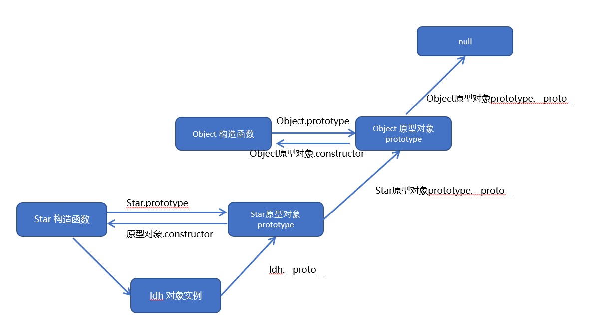

# 数据类型

typeof判断数据类型

- Number

  程序数字前加0表示八进制，010=8

  加0x表示十六进制

  Number.MAX_VALUE最大值

  Number.MIN_VALUE最小值

  三个特殊值：

  - Infinity无穷大
  - -Infinity无穷小
  - NaN非数值。isNaN()判断是否为非数字

- Boolean

- String

- Undefined

- Null

- Array

  ```javascript
  //instanceof检测是否为数组
  var arr[];
  return (arr instanceof Array);
  
  //Array.isArray()
  var arr[];
  return Array.isArray(arr);
  ```

  

- Object

  ```javascript
  function 构造函数名(){
      this.属性=值；
      this.方法=function(){
          .....
      }
  }
  new 构造函数名();//调用,返回一个对象
  
  //使用for in遍历
  for(变量 in 对象){
      ....
  }
  for(var k in obj){
      console.log(k);//输出属性名
      console.log(obj[k]);//输出属性值
  }
  ```

- function

  立即执行函数：(function(){})()或者(function(){}())

## 数据类型转换

### 转换为字符串

变量.toString()

String(变量)

拼接+ ‘ ’

.join('分隔符')

### 转换为数字型

parseInt(变量)只能取整

parseFloat()

Number(变量)

隐式转换 -,*,÷

### 转换为布尔型

Boolean()

' ',0,NaN,null,undefined转换为false，其他都是true

# 

# 部分内置对象

## Math

### 三个取整方法

- Math.floor()，全舍
- Math.ceil()，全入
- Math.round()，四舍五入，".5"往大的取

### 随机数random()

返回一个[0,1）范围随机的小数

**返回两个数之间的随机整数并包含这两个数**

```javascript
return Math.floor(Math.random()*(max-min+1))+min
```

## Date

**是一个构造函数，需要用new**

**月份0~11，周日为0**

### 获取总毫秒数

```javascript
//第一种
var date = new Date();
console.log(date.valueOf());
console.log(date.gettime());

//第二种
var date1 = +new Date();

//第三种
console.log(Date.now());
```

### 倒计时

```javascript
function countDown(time) {
    var nowTime = +new Date();
    var inputTime = +new Date(time);
    var times = (inputTime - nowTime)/1000;
    var day = parseInt(times/60/60/24);
    day = day<10 ? '0'+day:day;
    var hour = parseInt(times/60/60%24);
    hour = hour<10 ? '0'+hour:hour;
    var minute = parseInt(times/60%60);
    minute = minute<10 ? '0'+minute:minute;
    var second = parseInt(times%60);
    second = second<10 ? '0'+second:second;
}
```

## 数组

var arr[1,2,3]

#### 添加数组元素

arr.push(新加元素1,新加元素2……) 在原数组后添加元素，返回的是新数组的长度

arr.unshift(新加元素1,新加元素2……) 在原数组后添加元素，返回的是新数的长度

#### 删除数组元素

arr.pop()，没有参数，删除数组最后一个元素，返回删除的元素

arr.shift()，没有参数，删除数组第一个元素，返回删除的元素

#### 反转数组

arr.reverse();

#### 数组排序

arr.sort()，先排每一个元素左侧第一位，再排第二位

**冒泡排序**

```javascript
var arr[1,22,13,76,7];
arr1.sort(function(a,b){
    return a-b;//升序
    return b-a;//降序
})
```

#### 返回数组索引号

.indexOf(元素)，返回第一个满足条件的元素的索引号，找不到则返回-1

.lastIndexOf(元素)，返回最后一个满足条件的元素的索引号，找不到则返回-1

**去重**

```javascript
function unique(arr) {
    var newArr=[];
    for(var i = 0; i<arr.length;i++){
        if(newArr.indexOf(arr[i])===-1){
            newArr.push(arr[i]);
        }
    }
    return newArr;
}
```

## 字符串

### 根据位置返回字符

.charAt()，返回字符

.charCodeAt()，返回对应字符的asc码

str[]

**统计字符出现次数**

```javascript
function theMost(str){
    var allStr={};
    for(var i = 0;i<str.length;i++){
        var chars = str.chatAt(i);
        if(allStr[chars]){
            allStr[chars]++;
        }else{
            allStr[chars] = 1;
        }
    }
}
```

### 截取字符

.substr('起始位置','截取字符数')

### 替换字符

.replace('被替换的字符','替换为的字符')，只会替换第一个字符

### 转换为数组

.split('分隔符')


# 获取页面元素

```javascript
document.getElementById(id)
document.getElementsByTagName('标签名')
element.getElementsByTagName('标签名')
document.getElementsByClassName('类名')
document.querySelector('选择器')//根据指定选择器返回第一个元素对象,选择器要加符号
document.querySelectorAll('选择器')//选择器加符号

//获取特殊元素
document.body//返回body元素对象
document.documentElement//返回html元素对象
```

# 操作元素

## 改变元素内容

**innerText和innerHTML的区别**

- 获取内容时的区别：

​	innerText会去除空格和换行，而innerHTML会保留空格和换行	

- 设置内容时的区别：

​	innerText不会识别html，而innerHTML会识别

## 样式属性

element.ClassName

## 表单元素的属性

type，value，checked，selected，disabled

表单元素中有一些属性如：disabled、checked、selected，元素对象的这些属性的值是布尔型。

# 自定义属性

## 获取属性值

element.属性

element.getAttribute('属性')

## 设置属性值

element.属性='值'

element.setAttribute('属性','值')

## 移除属性

element.removeAttribute('属性')

.remove()也可以

## H5自定义属性

**data-**

```javascript
//获取
element.getAttribute('data-xxx')
element.dataset.xxx
element.dataset['xxx']
//后两个不太兼容
```

# 节点操作

一般地，节点至少拥有nodeType（节点类型）、nodeName（节点名称）和nodeValue（节点值）这三个基本属性。

## 节点层级

```javascript
node.parentNode//某节点最近的父节点
parentNode.childNodes//返回包含指定节点的子节点的集合（包括元素节点，文本节点等
parentNode.children//只获取子元素节点

//文本节点和元素节点
parentNode.firstChild
parentNode.lastChild

//子元素节点，有兼容性问题
parentNode.firstElementChild
parentNode.lastElementChild
//可以改用：
parentNode.chilren[0]
parentNode.chilren[parentNode.chilren.length - 1]


node.nextSibling//返回当前元素的下一个兄弟节点，找不到则返回null。也是包含所有的节点。
node.previousSibling//返回当前元素上一个兄弟节点

//元素节点，不兼容
node.nextElementSibling
node.previousElementSibling
//解决方法，封装一个函数
function getNextElementSibling(element) {
	var el = element;
 	while (el = el.nextSibling) {
 		if (el.nodeType === 1) {
 			return el;
 		}
 	}
 	return null;
 }
```

## 节点操作

### 创建节点

document.createElement('tagName')

### 添加节点

parentnode.appendChild(child)，将一个节点添加到指定父节点的子节点列表末尾

**appendChild不支持追加字符串的子元素，可以使用insertAdjacentHTML("位置","子元素")**

parentnode.insertBefore(child, 指定元素)，将一个节点添加到父节点的指定子节点前面

### 删除节点

parentnode.removeChild(child)，从 DOM 中删除一个子节点，返回删除的节点

### 复制节点

node.cloneNode()，返回调用该方法的节点的一个副本，复制后要写添加到的位置

1. **如果括号参数为空或者为 false ，则是浅拷贝，即只克隆复制节点本身，不克隆里面的子节点。**

2. **如果括号参数为 true ，则是深度拷贝，会复制节点本身以及里面所有的子节点。**

### 替换节点

parentNode.replaceChild(newChild, oldChild);

用指定的节点替换当前节点的一个子节点，并返回被替换掉的节点。

# 事件

## 注册事件

eventTarget.addEventListener('type', listener[, useCapture])

添加有名字的函数时不需要小括号

```javascript
//解决兼容性问题
function addEventListener(element, eventName, fn) {
 // 判断当前浏览器是否支持 addEventListener 方法
 if (element.addEventListener) {
 element.addEventListener(eventName, fn); // 第三个参数 默认是false
 } else if (element.attachEvent) {
 element.attachEvent('on' + eventName, fn);
 } else {
 // 相当于 element.onclick = fn;
 element['on' + eventName] = fn;
}
```


## 删除事件

eventTarget.removeEventListener(type, listener[, useCapture]);

不能用匿名函数

```javascript
divs[1].addEventListener('click', fn) // 里面的fn 不需要调用加小括号
        function fn() {
            alert(22);
            divs[1].removeEventListener('click', fn);
        }
```

## DOM事件流

DOM 事件流分为3个阶段：

1. 捕获阶段

2. 当前目标阶段

3. **冒泡阶段**

**addEventListener(type, listener[, useCapture])第三个参数如果是 true，表示在事件捕获阶段调用事件处理程序；如果是 false（不写默认就是false），表示在事件冒泡阶段调用事件处理程序。**

## 事件对象

eventTarget.addEventListener('click', function**(event)** {}）

这个 event 就是事件对象，也写成 e 或者 evt。事件发生后，跟事件相关的一系列信息数据的集合都放到这个对象里面，这个对象就是事件对象event，它有很多属性和方法。

### 事件对象常见属性和方法

- e.target  返回触发事件对象，标准
- e.srcElement  返回触发事件对象，非标准
- e.type  返回事件类型，比如click，mouseover
- e.cancelBubble=true  阻止冒泡，非标准
- e.stopPropagation()  阻止冒泡，标准
- e.returnValue  阻止默认行为，非标准
- e.preventDefault()  阻止默认行为，标准
- 也可以用return false  阻止默认行为

## 事件委托

不是每个子节点单独设置事件监听器，而是事件监听器设置在其父节点上，然后利用冒泡原理影响设置每个子节点

可以和e.target结合使用

## 鼠标键盘事件

各种触发，获取xy坐标，鼠标移动，键盘按下松开触发……查吧

**keypress 不识别功能键，比如左右箭头，shift 等，且区分大小写**

```javascript
//图片跟踪鼠标
var pic = document.querySelector('img');
document.addEventListener('mousemove', function(e) {
var x = e.pageX;
var y = e.pageY;
pic.style.top = y + 'px';
pic.style.left = x + 'px';//注意加单位，可以根据图片大小对x，y适当调整
})
```

# window 对象的常见事件

## 窗口加载

- window.addEventListener("load",function(){});当文档内容完全加载完成会触发该事件(包括图像、脚本文件、CSS 文件等), 就调用的处理函数。
- document.addEventListener('DOMContentLoaded',function(){})仅当DOM加载完成，不包括样式表，图片，flash等等。Ie9以上才支持

## 调整窗口大小事件

window.addEventListener("resize",function(){});

- 只要窗口大小发生像素变化，就会触发这个事件。
- 经常利用这个事件完成响应式布局。 **window.innerWidth 当前屏幕的宽度**

# 定时器

## setTimeout() 

**window.setTimeout(调用函数, [延迟的毫秒数]);**

- window 可以省略。
- 这个调用函数可以直接写函数，或者写函数名或者采取字符串‘函数名()'三种形式。第三种不推荐
- 延迟的毫秒数省略默认是 0，如果写，必须是毫秒。
- 因为定时器可能有很多，所以我们经常给定时器赋值一个标识符。
- setTimeout() 这个调用函数我们也称为回调函数 callback

**停止 setTimeout() 定时器**

window.clearTimeout(timeoutID)

## **setInterval()**

**window.setInterval(回调函数, [间隔的毫秒数]);**

重复调用一个函数，每隔这个时间，就去调用一次回调函数。

**停止 setInterval() 定时器**

window.clearInterval(intervalID);

```javascript
//发送短信之间有数秒间隔
var btn = document.querySelector('button');
		// 全局变量，定义剩下的秒数
        var time = 3; 
		// 注册单击事件
        btn.addEventListener('click', function() {
            // 禁用按钮
            btn.disabled = true;
            // 开启定时器
            var timer = setInterval(function() {
                // 判断剩余秒数
                if (time == 0) {
                    // 清除定时器和复原按钮
                    clearInterval(timer);
                    btn.disabled = false;
                    btn.innerHTML = '发送';
                } else {
                    btn.innerHTML = '还剩下' + time + '秒';
                    time--;
                }
            }, 1000);
        });
```

# this的指向问题

this的指向在函数定义的时候是确定不了的，只有函数执行的时候才能确定this到底指向谁，一般情况下this的最终指向的是那个调用它的对象。

现阶段先了解一下几个this指向

1. 全局作用域或者普通函数中this指向全局对象window（注意定时器里面的this指向window）

2. 方法调用中谁调用this指向谁
3. 构造函数中this指向构造函数的实例

# JS执行机制

## 同步和异步

### 同步任务

同步任务都在主线程上执行，形成一个执行栈。

### 异步任务

JS 的异步是通过回调函数实现的。

- 一般而言，异步任务有以下三种类型: 
- 普通事件，如 click、resize 等 
- 资源加载，如 load、error 等 
- 定时器，包括 setInterval、setTimeout 等

异步任务相关回调函数添加到**任务队列**中（任务队列也称为消息队列）。

## 执行机制

1. 先执行执行栈中的同步任务。 

2. 异步任务（回调函数）放入任务队列中。

3. 一旦执行栈中的所有同步任务执行完毕，系统就会按次序读取任务队列中的异步任务，于是被读取的异步任务结束等待状态，进入执行栈，开始执行。

# location对象

## **location.href** 获取URL

```javascript
//五秒后跳转页面
var btn = document.querySelector('button');
        var div = document.querySelector('div');
        btn.addEventListener('click', function() {
        var timer = 5;
        setInterval(function() {
            if (timer == 0) {
                location.href = '#';
            } else {
                div.innerHTML = '将在' + timer + '秒钟之后跳转到首页';
                timer--;
            }
        }, 1000);
```

## **location.search**返回参数

```html
//获取另一个页面中输入的名字

//先在第一个页面用<form>的action提交表单
<body>
    <form action='index.html'>
        用户名：<input type='text' name='uname'>
            <input type='submit' value='登录'>
    </form>
</body>
//在第二个页面对参数处理
    <script>
        console.log(location.search); // ?uname=andy
        // 1.先去掉？  substr('起始的位置'，截取几个字符);
        var params = location.search.substr(1); // uname=andy
        console.log(params);
        // 2. 利用=把字符串分割为数组 split('=');
        var arr = params.split('=');
        console.log(arr); // ["uname", "ANDY"]
        var div = document.querySelector('div');
        // 3.把数据写入div中
        div.innerHTML = arr[1] + '欢迎您';
    </script>
```

##  location 对象的方法

```javascript
location.assign()//类似href跳转页面，可以后退

location.replace()//替换当前页面，不记录历史，不能后退页面

location.reload()//重新加载，刷新，若()中参数为true，则强制刷新
```

# **navigator 对象**

navigator 对象包含有关浏览器的信息，它有很多属性，我们最常用的是 userAgent，该属性可以返回由客户机发送服务器的 user-agent 头部的值。

```javascript
//判断用户打开页面的终端实现跳转
if((navigator.userAgent.match(/(phone|pad|pod|iPhone|iPod|ios|iPad|Android|Mobile|BlackBerry|IEMobile|MQQBrowser|JUC|Fennec|wOSBrowser|BrowserNG|WebOS|Symbian|Windows Phone)/i))) {
    window.location.href = "";     //手机
 } else {
    window.location.href = "";     //电脑
 }
```

# history对象

```javascript
history.back()//后退
history.forward()//前进
history.go(参数)//前进或后退参数个页面，看参数正负
```

# 元素偏移量offset

使用 offset 系列相关属性可以动态的得到该元素的位置（偏移）、大小等。

- 获得元素距离带有定位父元素的位置

- 获得元素自身的大小（宽度高度）

- 注意：返回的数值都不带单位

## 属性

```javascript
element.offsetParent//返回该元素带有定位的父级元素，父级元素没有定位则返回body
element.offsetTop//返回元素相对带有定位父元素上方的偏移
element.offsetLeft//返回元素相对带有定位父元素左边框的偏移
element.offsetWidth//返回自身宽度，包括padding，border，content，没有单位
element.offsetHeight//返回自身高度，包括padding，border，content，没有单位
```

## offset和style

**offset**

- offset 可以得到任意样式表中的样式值
- offset 系列获得的数值是没有单位的
- offsetWidth 包含padding+border+width
- offsetWidth 等属性是只读属性，只能获取不能赋值。想要获取元素大小位置，用offset更合适

**style**

- style 只能得到行内样式表中的样式值

- style.width 获得的是带有单位的字符串

- style.width 获得不包含padding和border 的值

- style.width 是可读写属性，可以获取也可以赋值。想要给元素更改值，则需要用style改变

## 模态框拖拽

```javascript
// (1) 当我们鼠标按下， 就获得鼠标在盒子内的坐标
title.addEventListener('mousedown', function(e) {
      var x = e.pageX - login.offsetLeft;
      var y = e.pageY - login.offsetTop;
      // (2) 鼠标移动的时候，把鼠标在页面中的坐标，减去 鼠标在盒子内的坐标就是模态框的left和top值
      document.addEventListener('mousemove', move)

      function move(e) {
          login.style.left = e.pageX - x + 'px';
          login.style.top = e.pageY - y + 'px';
      }
      // (3) 鼠标弹起，就让鼠标移动事件移除
      document.addEventListener('mouseup', function() {
          document.removeEventListener('mousemove', move);
      })
})
```

# 元素可视区 client

```javascript
element.clientTop//，返回元素上边框的大小
element.clientLeft//返回元素左边框的大小
element.clientWidth//返回自身宽度，包括padding，content，不包括border，没有单位
element.clientHeight//返回自身高度，包括padding，content，不包括border，没有单位
```

# 元素滚动 scroll

```javascript
element.scrollTop//返回被卷去的上侧距离，没有单位
element.scrollLeft//返回被卷去的左侧距离，没有单位
element.scrollWidth//返回自身实际的宽度，不含边框，没有单位
element.scrollHeight//返回自身实际的高度，不含边框，没有单位
```

**页面被卷去的头部：可以通过window.pageYOffset 获得 如果是被卷去的左侧 window.pageXOffset。元素被卷去的头部是element.scrollTop**

# mouseenter 和mouseover

- 当鼠标移动到元素上时就会触发mouseenter 事件
- 类似 mouseover，它们两者之间的差别是mouseover 鼠标经过自身盒子会触发，经过子盒子还会触发。mouseenter  只会经过自身盒子触发
- 之所以这样，就是因为mouseenter不会冒泡
- 跟mouseenter搭配鼠标离开 mouseleave  同样不会冒泡

# Ajax

## Ajax的实现步骤

```javascript
//1.  创建 Ajax 对象
var xhr = new XMLHttpRequest();
//2.  告诉 Ajax 请求地址以及请求方式
xhr,open('方式','地址')
//3.  发送请求
xhr.send();
//4.  获取服务器端给与客户端的响应数据
xhr.onload=function(){
    console.log(xhr.responseText);
}

 xhr.onreadystatechange = function(){
                //判断
    if(xhr.readyState === 4){
        if(xhr.status >= 200 && xhr.status < 300){
                        //处理服务端返回的结果
            result.innerHTML = xhr.response;
        }
    }
 }
```

**服务器端大多数情况下会以 JSON 对象作为响应数据的格式。当客户端拿到响应数据时， 要将 JSON 数据和 HTML 字符串进行拼接，然后将拼接的结果展示在页面中。**

## 超时与网络异常

```javascript
const xhr = new XMLHttpRequest();
//超时设置 2s 设置
xhr.timeout = 2000;
//超时回调
xhr.ontimeout = function(){
    alert("网络异常, 请稍后重试!!");
}
//网络异常回调
xhr.onerror = function(){
    alert("你的网络似乎出了一些问题!");
}
```

## 取消请求

.abort()

## 重复请求的问题

```js
btns[0].onclick = function () {
        //判断标识变量
        if (isSending) x.abort(); // 如果正在发送, 则取消该请求, 创建一个新的请求
        x = new XMLHttpRequest();
        //修改 标识变量的值
        isSending = true;
        x.open("GET", "xxx");
        x.send();
        x.onreadystatechange = function () {
          if (x.readyState === 4) {
            //修改标识变量
            isSending = false;
          }
        };
      };
```

## 跨域

### JSONP

在网页有一些标签天生具有跨域能力，比如：img link iframe script。 JSONP 就是利用 script 标签的跨域能力来发送请求的。

```javascript
//1.动态的创建一个 script 标签 
var script = document.createElement("script"); 
//2.设置 script 的 src，设置回调函数 
script.src = "http://localhost:3000/testAJAX?callback=abc"; function abc(data) { 
    alert(data.name); 
}; 
//3.将 script 添加到 body 中
document.body.appendChild(script); 


//4.服务器中路由的处理 
router.get("/testAJAX" , function (req , res) { 
    console.log("收到请求"); 
    var callback = req.query.callback; 
    var obj = {
        name:"xx", 
        age:18 
    }
    res.send(callback+"("+JSON.stringify(obj)+")"); 
});
```

### CORS

CORS 是通过设置一个响应头来告诉浏览器，该请求允许跨域，浏览器收到该响应 以后就会对响应放行。主要是服务器端的设置

```js
router.get("/testAJAX" , function (req , res) {
    //通过 res 来设置响应头，来允许跨域请求 
    //res.set("Access-Control-Allow-Origin","http://127.0.0.1:3000"); 
    res.set("Access-Control-Allow-Origin","*"); 
    res.send("testAJAX 返回的响应"); 
});
```

# 类

## 创建类

```js
//步骤1 使用class关键字
class People {
  // class body
  // 类的共有属性放到 constructor 里面
 	constructor(name, age) {
 		this.name = name;
 		this.age = age;
    }//注意,方法与方法之间不需要添加逗号
    doIt(){
        console.log("...");
    }
}     

//步骤2使用定义的类创建实例  注意new关键字
var xx = new People("name","age"); 
xx.doIt("...");
```

1. 通过class 关键字创建类, 类名我们还是习惯性定义首字母大写
2. 类里面有个constructor 函数,可以接受传递过来的参数,同时返回实例对象
3. constructor 函数 只要 new 生成实例时,就会自动调用这个函数, 如果我们不写这个函数,类也会自动生成这个函数
4. 多个函数方法之间不需要添加逗号分隔
5. 生成实例 new 不能省略
6. 语法规范, 创建类 类名后面不要加小括号,生成实例 类名后面加小括号, 构造函数不需要加function

## 类的继承

```js
// 父类
class Father{   
} 

// 子类继承父类
class  Son  extends Father {  
} 
```

**super关键字**

```js
//定义了父类
class Father {
   constructor(x, y) {
   this.x = x;
   this.y = y;
   }
   sum() {
   console.log(this.x + this.y);
	}
 }
//子元素继承父类同时扩展减法方法
    class Son extends Father {
   		 constructor(x, y) {
    		super(x, y); //使用super调用了父类中的构造函数,必须在子类this之前调用,放到this之后会报错
            this.x = x;
   			this.y = y;
    	}
        subtract() {
  			console.log(this.x - this.y);
  		}
    }
    var son = new Son(1, 2);
    son.sum(); //结果为3
	son.subtract();//-1
```

1. 继承中,如果实例化子类输出一个方法,先看子类有没有这个方法,如果有就先执行子类的
2. 继承中,如果子类里面没有,就去查找父类有没有这个方法,如果有,就执行父类的这个方法(就近原则)
3. **如果子类想要继承父类的方法,同时在自己内部扩展自己的方法,利用super 调用父类的构造函数,super 必须在子类this之前调用**
4. 时刻注意this的指向问题,类里面的共有的属性和方法一定要加this使用.
   1. constructor中的this指向的是new出来的实例对象 
   2. 自定义的方法,一般也指向的new出来的实例对象
   3. 绑定事件之后this指向的就是触发事件的事件源
5. 在 ES6 中类没有变量提升，所以必须先定义类，才能通过类实例化对象

```js
class Star {
    constructor(uname){
        this.uname=uname;
        this.btn=document.querySelector('button');
        this.btn.onclick=this.sing;//不加()点击时调用，加()直接调用
    }
    sing(){
        console.log(this.uname);//加this，不过在上面绑定了btn的情况下输出undefined，可以提前声明一个that，然后在constructor里面that=this，sing里面console.log(that.uname)
    }
}
```

# 构造函数和原型

## 对象的三种创建方式

1. 字面量方式

   ```js
   var obj = {};
   ```

2. new关键字

   ```js
   var obj = new Object();
   ```

3. 构造函数方式

   ```js
   function Person(name,age){
     this.name = name;
     this.age = age;
   }
   var obj = new Person('zs',12);
   ```

## 静态成员和实例成员

### 实例成员

实例成员就是构造函数内部通过this添加的成员 如下列代码中uname age sing 就是实例成员,实例成员只能通过实例化的对象来访问

### 静态成员

静态成员 在构造函数本身上添加的成员  如下列代码中 sex 就是静态成员,静态成员只能通过构造函数来访问

```js
 function Star(uname, age) {
     this.uname = uname;
     this.age = age;
     this.sing = function() {
     console.log('唱歌');
    }
}
Star.sex = '男';
var xx = new Star('xx', 18);
console.log(xx.uname);//实例成员只能通过实例化的对象来访问
console.log(Star.sex);//静态成员只能通过构造函数来访问
```

## 构造函数的问题

浪费内存，不同的new给相同的函数开辟了不同的空间

## 构造函数原型prototype

构造函数通过原型分配的函数是所有对象所共享的。

JavaScript 规定，每一个构造函数都有一个prototype 属性，指向另一个对象。注意这个prototype就是一个对象，这个对象的所有属性和方法，都会被构造函数所拥有。

我们可以把那些不变的方法，直接定义在 prototype 对象上，这样所有对象的实例就可以共享这些方法。

```js
function Star(uname, age) {
    this.uname = uname;
    this.age = age;
}
Star.prototype.sing = function() {
	console.log('唱歌');
}
var A = new Star('A', 18);
var B = new Star('B', 19);
A.sing();//唱歌
B.sing();//唱歌
console.log(A.sing===B.sing);//true
```

## 对象原型

对象都会有一个属性 `__proto__` 指向构造函数的 prototype 原型对象，之所以我们对象可以使用构造函数 prototype 原型对象的属性和方法，就是因为对象有  `__proto__` 原型的存在。
 `__proto__`对象原型和原型对象 prototype 是等价的
 `__proto__`对象原型的意义就在于为对象的查找机制提供一个方向，或者说一条路线，但是它是一个非标准属性，因此实际开发中，不可以使用这个属性，它只是内部指向原型对象 prototype

```js
//上面代码添加：
console.log(A.__proto__===Star.prototype);//true
```

查找规则类似类的继承，先看对象身上是否有sing方法，有则执行，如果没有，因为有`__proto__`的存在，就去构造函数原型对象prototype身上去查找sing方法

## constructor构造函数

对象原型（ `__proto__`）和构造函数（prototype）原型对象里面都有一个属性 constructor 属性 ，constructor 我们称为构造函数，因为它指回构造函数本身。
constructor 主要用于记录该对象引用于哪个构造函数，它可以让原型对象重新指向原来的构造函数。
一般情况下，对象的方法都在构造函数的原型对象中设置。如果有多个对象的方法，我们可以给原型对象采取对象形式赋值，但是这样就会覆盖构造函数原型对象原来的内容，这样修改后的原型对象 constructor  就不再指向当前构造函数了。此时，我们可以在修改后的原型对象中，添加一个 constructor 指向原来的构造函数。

```js
function Star(uname, age) {
    this.uname = uname;
    this.age = age;
}
 Star.prototype = {
 // 如果我们修改了原来的原型对象,给原型对象赋值的是一个对象,则必须手动的利用constructor指回原来的构造函数
   constructor: Star, // 手动设置指回原来的构造函数
   sing: function() {
     console.log('唱歌');
   },
   movie: function() {
     console.log('电影');
   }
}
```

## 原型链

每一个实例对象又有一个`__proto__`属性，指向的构造函数的原型对象，构造函数的原型对象也是一个对象，也有`__proto__`属性，这样一层一层往上找就形成了原型链。

查找机制也是从底层实例往上查找，直到Object



### 原型对象中this指向

构造函数中的this和原型对象的this,都指向我们new出来的实例对象

### 通过原型为数组扩展内置方法

```js
Array.prototype.sum = function() {
   var sum = 0;
   for (var i = 0; i < this.length; i++) {
   sum += this[i];
   }
   return sum;
 };
 //此时数组对象中已经存在sum()方法了  可以始终 数组.sum()进行数据的求
```

# 继承

## call()

- call()可以调用函数
- call()可以修改this的指向,使用call()的时候 参数一是修改后的this指向,参数2,参数3..使用逗号隔开连接

```js
 function fn(x, y) {
     console.log(this);
     console.log(x + y);
}
  var o = {
  	name: 'andy'
  };
  fn.call(o, 1, 2);//调用了函数此时的this指向了对象o,若不修改，this的指向是window
```

## 子构造函数继承父构造函数中的属性

```js
 // 1. 父构造函数
 function Father(uname, age) {
   // this 指向父构造函数的对象实例
   this.uname = uname;
   this.age = age;
 }
  // 2 .子构造函数 
function Son(uname, age, score) {
  // this 指向子构造函数的对象实例
  //3.使用call方式实现子继承父的属性
  Father.call(this, uname, age);
  this.score = score;
}
var son = new Son('xxx', 18, 100);
console.log(son);
```

## 借用原型对象继承方法

```js
// 1. 父构造函数
function Father(uname, age) {
  // this 指向父构造函数的对象实例
  this.uname = uname;
  this.age = age;
}
Father.prototype.money = function() {
  console.log(100000);
 };
 // 2 .子构造函数 
  function Son(uname, age, score) {
      // this 指向子构造函数的对象实例
      Father.call(this, uname, age);
      this.score = score;
  }
// Son.prototype = Father.prototype;  这样直接赋值会有问题,如果修改了子原型对象,父原型对象也会跟着一起变化
  Son.prototype = new Father();
  // 如果利用对象的形式修改了原型对象,还要利用constructor 指回原来的构造函数
  Son.prototype.constructor = Son;
  // 这个是子构造函数专门的方法
  Son.prototype.exam = function() {
    console.log('考试');

  }
  var son = new Son('xxx', 18, 100);
  console.log(son);
```

# ES5新增方法

## 数组方法

### forEach遍历数组

```js
 arr.forEach(function(value, index, array) {
       //value:数组元素
       //index:数组元素的索引
       //array:当前的数组
 })
  //相当于数组遍历的 for循环 没有返回值
```

### filter过滤数组

```js
  var arr = [12, 66, 4, 88, 3, 7];
  var newArr = arr.filter(function(value, index,array) {
  	 //value:数组元素
     //index:数组元素的索引
     //array:当前的数组
     return value >= 20;
  });
  console.log(newArr);//[66,88] //返回值是一个新数组
```

### some

```js
//some 查找数组中是否有满足条件的元素 
 var arr = [10, 30, 4];
 var flag = arr.some(function(value,index,array) {
     return value < 3;
  });
console.log(flag);//false返回值是布尔值,只要查找到满足条件的一个元素就立马终止循环
```

### some和forEach区别

- 如果查询数组中唯一的元素, 用some方法更合适,在some 里面 遇到 return true 就是终止遍历 迭代效率更高
- 在forEach 里面 return 不会终止迭代

### trim方法去除字符串两端的空格

```js
var str = '   hello   '
console.log(str.trim()）  //hello 去除两端空格
var str1 = '   he l l o   '
console.log(str.trim()）  //he l l o  去除两端空格
```

### Object.keys获取对象的属性名

```js
 var obj = {
     id: 1,
     pname: '小米',
     price: 1999,
     num: 2000
};
var result = Object.keys(obj)
console.log(result)//[id，pname,price,num]
```

### Object.defineProperty

Object.defineProperty设置或修改对象中的属性

```js
Object.defineProperty(对象，修改或新增的属性名，{
		value:修改或新增的属性的值,
		writable:true/false,//如果值为false 不允许修改这个属性值
		enumerable: false,//enumerable 如果值为false 则不允许遍历
        configurable: false  //configurable 如果为false 则不允许删除这个属性 属性是否可以被删除或是否可以再次修改特性
})	
```

# 函数的定义、调用与this指向总结

## 函数的定义方式

```js
//方式1 函数声明方式 function 关键字 (命名函数)
function fn(){}

//方式2 函数表达式(匿名函数)
var fn = function(){}

//方式3 new Function() 
var fn = new Function('参数1','参数2'..., '函数体')
//例如：
var f = new Function('a', 'b', 'console.log(a + b)');
f(1, 2);
//Function 里面参数都必须是字符串格式.第三种方式执行效率低，也不方便书写，因此较少使用.所有函数都是 Function 的实例(对象),函数也属于对象
```

## 函数的调用与this指向

```js
//1. 普通函数
function fn() {
	console.log('hi');
    console.log(this);//指向window
}
fn(); 

//2. 对象的方法
var o = {
  sayHi: function() {
  	console.log('hi');
    console.log(this);//指向对象o
  }
}
o.sayHi();

//3. 构造函数
function Star() {
    console.log(this);
    //指向实例对象xx，原型对象里面的this也指向xx实例对象
};
var xx=new Star();

//4. 绑定事件函数
btn.onclick = function() {
    console.log(this);//指向btn
};//点击即调用

//5. 定时器函数
setInterval(function() {
    console.log(this);//window
}, 1000);//每一秒调用一次

//6. 立即执行函数(自调用函数)
(function() {
	console.log('hi');
    console.log(this);//window
})();
```

## 改变函数内部 this 指向

### call

看继承那里，经常在继承时使用

### apply

apply() 方法调用一个函数。简单理解为调用函数的方式，但是它可以改变函数的 this 指向，传递的参数是数组

应用场景:  经常跟数组有关系

```js
var o = {
	name: 'andy'
}
 function fn(a, b) {
      console.log(this);
      console.log(a+b)
};
fn()// 此时的this指向的是window 运行结果为3
fn.apply(o,[1,2])//此时的this指向的是对象o,参数使用数组传递 运行结果为3
```

```js
//用apply与Math结合求数组中最大值
var arr=[11,22,33,44];
var max=Math.max.apply(Math,arr);
```

### bind

bind() 方法不会调用函数,但是能改变函数内部this 指向,返回的是原函数改变this之后产生的新函数。如果只是想改变 this 指向，并且不想立即调用这个函数的时候，可以使用bind

应用场景:不调用函数,但是还想改变this指向

```js
 var o = {
 name: 'andy'
 };

function fn(a, b) {
	console.log(this);
	console.log(a + b);
};
var f = fn.bind(o, 1, 2); //此处的f是bind返回的新函数
f();//调用新函数  this指向的是对象o 参数使用逗号隔开
```

```js
//bind改变定时器内的this指向
var btn = document.querySelector('button');
btn.onclick = function(){
    this.disabled = true;//this指向btn按钮
    setTimeOut(function(){
        this.disabled = false;
    }.bind(this),3000)
}
//其他方法如在setTimeOut外部设置var that=this，或直接写btn
```


### call、apply、bind三者的异同

- 共同点 : 都可以改变this指向
- 不同点:
  - call 和 apply  会调用函数, 并且改变函数内部this指向.
  - call 和 apply传递的参数不一样,call传递参数使用逗号隔开,apply使用数组传递
  - bind  不会调用函数, 可以改变函数内部this指向.


- 应用场景
  1. call 经常做继承. 
  2. apply经常跟数组有关系.  比如借助于数学对象实现数组最大值最小值
  3. bind  不调用函数,但是还想改变this指向. 比如改变定时器内部的this指向

# 严格模式

[严格模式要求参考](https://developer.mozilla.org/zh-CN/docs/Web/JavaScript/Reference/Strict_mode)

## 开启严格模式

严格模式可以应用到整个脚本或个别函数中。因此在使用时，我们可以将严格模式分为为脚本开启严格模式和为函数开启严格模式两种情况。

- 情况一 :为脚本开启严格模式

  有的 script 脚本是严格模式，有的 script 脚本是正常模式，这样不利于文件合并，所以可以将整个脚本文件放在一个立即执行的匿名函数之中。这样独立创建一个作用域而不影响其他script 脚本文件。

  ```js
  (function (){
    //在当前的这个自调用函数中有开启严格模式，当前函数之外还是普通模式
  　　　　"use strict";
         var num = 10;
  　　　　function fn() {}
  })();
  //或者 
  <script>
    　"use strict"; //当前script标签开启了严格模式
  </script>
  <script>
    			//当前script标签未开启严格模式
  </script>
  ```

- 情况二: 为函数开启严格模式

  要给某个函数开启严格模式，需要把“use strict”;  (或 'use strict'; ) 声明放在函数体所有语句之前。

```js
function fn(){
　　"use strict";
　　return "123";
} 
//当前fn函数开启了严格模式
```

## 严格模式中的变化

```js
'use strict'
num = 10 
console.log(num)//严格模式后使用未声明的变量报错
--------------------------------------------------------------------------------
var num2 = 1;
delete num2;//严格模式不允许删除变量
--------------------------------------------------------------------------------
function fn() {
 console.log(this); // 严格模式下全局作用域中函数中的 this 是 undefined
}
fn();  
---------------------------------------------------------------------------------
function Star() {
	 this.sex = '男';
}
// Star();严格模式下,如果构造函数不加new调用, this 指向的是undefined 如果给他赋值则会报错.
var ldh = new Star();
console.log(ldh.sex);
----------------------------------------------------------------------------------
setTimeout(function() {
  console.log(this); //严格模式下，定时器 this 还是指向 window
}, 2000);  
```

# 高阶函数

高阶函数是对其他函数进行操作的函数，它接收函数作为参数或将函数作为返回值输出。

```html
<script>
    function fn(callback){
        callback&&callback();
    }
    fn(function(){alert('hi')}
</script>


<script>
    function fn(){
        return function() {}
    }
    fn();
</script>
```

# 闭包

闭包（closure）指有权访问另一个函数作用域中变量的函数。简单理解就是 ，一个作用域可以访问另外一个函数内部的局部变量。

作用：延伸变量的作用范围。

```js
function fn1(){ // fn1 就是闭包函数
    var num = 10;
    function fn2(){
        console.log(num); // 10
    }
    fn2();
}
fn1();

//或者
function fn1(){ // fn1 就是闭包函数
    var num = 10;
    function fn2(){
        console.log(num); // 10
    }
    return fn2;
}
var fun = fn1();
fun();
```

## 使用闭包获取循环中的i

```js
for (var i = 0; i < lis.length; i++) {
// 利用for循环创建了4个立即执行函数
// 立即执行函数也成为小闭包因为立即执行函数里面的任何一个函数都可以使用它的i这变量
	(function(i) {
	    lis[i].onclick = function() {
    	  console.log(i);
   		 }
	 })(i);
    
    //闭包应用-3秒钟之后,打印所有li元素的内容
     (function(i) {
     	setTimeout(function() {
    		 console.log(lis[i].innerHTML);
    	 }, 3000)
     })(i);
}
```

## 闭包思考题

```js
//无闭包
var name = "The Window";
   var object = {
     name: "My Object",
     getNameFunc: function() {
     	return function() {
     		return this.name;
     	};
   	}
 };
console.log(object.getNameFunc()())

/*相当于
var fn = object.getNameFunc()()
即 fn = function(){
	   return this.name
   }
   fn();
function(){this}()类似于立即执行函数，立即执行函数的this指向window
最终输出The Window */
```

```js
//有闭包
var name = "The Window";　　
  var object = {　　　　
    name: "My Object",
    getNameFunc: function() {
    	var that = this;
    	return function() {
    		return that.name;
    	};
   }
};
console.log(object.getNameFunc()())//My Object
```

# 递归

```js
//利用递归遍历数据
var data = [{
    id: 1,
    name: '家电',
    goods: [{
        id: 11,
        gname: '冰箱',
        goods: [{
            id: 111,
            gname: '海尔'
        }, {
            id: 112,
            gname: '美的'
        }]
    }, {
        id: 12,
        gname: '洗衣机'
    }]
}, {
    id: 2,
    name: '服饰'
}];
//1.利用 forEach 去遍历里面的每一个对象
 function getID(json, id) {
   var o = {};
   json.forEach(function(item) {
     // console.log(item); // 2个数组元素
     if (item.id == id) {
       // console.log(item);
       o = item;
       return o;
       // 2. 我们想要得里层的数据 11 12 可以利用递归函数
       // 里面应该有goods这个数组并且数组的长度不为 0 
     } else if (item.goods && item.goods.length > 0) {
       o = getID(item.goods, id);
     }
   });
   return o;
}
```

# 浅拷贝与深拷贝

```js
//浅拷贝只拷贝一层，更深层次对象级别的是引用地址
var obj = {
    id:1,
    uname:'andy',
    info:{
        age:18
    }
}
var o = {};
for(var k in obj){
    //k是属性名，obj[k]是属性值
    o[k]=obj[k];
}
console.log(o);
//如果修改o.info.age，obj中的age也会随着改变

//Object.assign(target,...source)实现浅拷贝
Object.assign(o,obj);
```

```js
//深拷贝，全部都拷贝
var obj = {
    id:1,
    uname:'andy',
    info:{
        age:18
    }
    like:['eating','sleeping']
}
var o={};
//封装函数
function deepCopy(newObj,oldObj){
    for(var k in oldObj){
        var item = oldObj[k];
        //判断属性值的数据类型
        if(item instanceof Array){	//判断数组
            newObj[k]=[];
            deepCopy(newObj[k],item);
        } else if(item instanceof Object){	//判断对象
            newObj[k]={};
            deepCopy(newObj[k],item);
        }else{
            newObj[k]=item;
        }
    }
}

deepCopy(o,obj);
//修改o中的对象不会影响obj
```

# 正则表达式

## 正则表达式的创建

方式一：通过调用RegExp对象的构造函数创建 

```js
var regexp = new RegExp(/123/);
console.log(regexp);
```

方式二：利用字面量创建 正则表达式

```js
 var rg = /123/;
```

## 测试正则表达式

test() 正则对象方法，用于检测字符串是否符合该规则，该对象会返回 true 或 false，其参数是测试字符串。

```js
var rg = /123/;
console.log(rg.test(123));//匹配字符中是否出现123  出现结果为true
console.log(rg.test('abc'));//未出现123结果为false
```

## 正则表达式的组成

一个正则表达式可以由简单的字符构成，比如 /abc/，也可以是简单和特殊字符的组合，比如 /ab*c/ 。其中特殊字符也被称为元字符，在正则表达式中是具有特殊意义的专用符号，如 ^ 、$ 、+ 等。

特殊字符非常多，可以参考： 

[MDN](https://developer.mozilla.org/zh-CN/docs/Web/JavaScript/Guide/Regular_Expressions)

### 边界符

正则表达式中的边界符（位置符）用来提示字符所处的位置，主要有两个字符

| 边界符 | 说明                           |
| ------ | ------------------------------ |
| ^      | 表示匹配行首的文本（以谁开始） |
| $      | 表示匹配行尾的文本（以谁结束） |

如果 ^和 $ 在一起，表示必须是精确匹配。

```js
var rg = /abc/; // 正则表达式里面不需要加引号 不管是数字型还是字符串型
// /abc/ 只要包含有abc这个字符串返回的都是true
console.log(rg.test('abc'));
console.log(rg.test('abcd'));
console.log(rg.test('aabcd'));
console.log('---------------------------');
var reg = /^abc/;
console.log(reg.test('abc')); // true
console.log(reg.test('abcd')); // true
console.log(reg.test('aabcd')); // false
console.log('---------------------------');
var reg1 = /^abc$/; // 精确匹配 要求必须是 abc字符串才符合规范
console.log(reg1.test('abc')); // true
console.log(reg1.test('abcd')); // false
console.log(reg1.test('aabcd')); // false
console.log(reg1.test('abcabc')); // false
```

### 字符类

字符类表示有一系列字符可供选择，只要匹配其中一个就可以了。所有可供选择的字符都放在方括号内。

#### []方括号

表示有一系列字符可供选择，只要匹配其中一个就可以了

```js
var rg = /[abc]/; // 只要包含有a 或者 包含有b 或者包含有c 都返回为true
console.log(rg.test('andy'));//true
console.log(rg.test('baby'));//true
console.log(rg.test('color'));//true
console.log(rg.test('red'));//false
var rg1 = /^[abc]$/; // 三选一 只有是a 或者是 b  或者是c 这三个字母才返回 true
console.log(rg1.test('aa'));//false
console.log(rg1.test('a'));//true
console.log(rg1.test('b'));//true
console.log(rg1.test('c'));//true
console.log(rg1.test('abc'));//false
----------------------------------------------------------------------------------
var reg = /^[a-z]$/ //26个英文字母任何一个字母返回 true  - 表示的是a 到z 的范围  
console.log(reg.test('a'));//true
console.log(reg.test('z'));//true
console.log(reg.test('A'));//false
-----------------------------------------------------------------------------------
//字符组合
var reg1 = /^[a-zA-Z0-9]$/; // 26个英文字母(大写和小写都可以)任何一个字母返回 true  
------------------------------------------------------------------------------------
//取反 方括号内部加上 ^ 表示取反，只要包含方括号内的字符，都返回 false 。
var reg2 = /^[^a-zA-Z0-9]$/;
console.log(reg2.test('a'));//false
console.log(reg2.test('B'));//false
console.log(reg2.test(8));//false
console.log(reg2.test('!'));//true
```

#### 量词符

量词符用来设定某个模式出现的次数。

| 量词  | 说明            |
| ----- | --------------- |
| *     | 重复0次或更多次 |
| +     | 重复1次或更多次 |
| ?     | 重复0次或1次    |
| {n}   | 重复n次         |
| {n,}  | 重复n次或更多次 |
| {n,m} | 重复n到m次      |

```js
var reg = /^a*$/;
var reg = /^a+$/;
var reg = /^a?$/;
var reg = /^a{3}$/;
var reg = /^a{3,}$/;
var reg = /^a{3,5}$/;

var reg = /^abc{3}$/;//只有abccc才是true
```

### 预定义类


## 正则替换replace

replace() 方法可以实现替换字符串操作，用来替换的参数可以是一个字符串或是一个正则表达式。

```js
var str = 'andy和red';
var newStr = str.replace('andy', 'baby');
console.log(newStr)//baby和red
//等同于 此处的andy可以写在正则表达式内
var newStr2 = str.replace(/andy/, 'baby');
console.log(newStr2)//baby和red
//全部替换
var str = 'abcabc'
var nStr = str.replace(/a/,'哈哈')
console.log(nStr) //哈哈bcabc
//全部替换g
var nStr = str.replace(/a/a,'哈哈')
console.log(nStr) //哈哈bc哈哈bc
//忽略大小写i
var str = 'aAbcAba';
var newStr = str.replace(/a/gi,'哈哈')//"哈哈哈哈bc哈哈b哈哈"
```

**案例:过滤敏感词汇**

```js
<textarea name="" id="message"></textarea> <button>提交</button>
<div></div>
<script>
    var text = document.querySelector('textarea');
    var btn = document.querySelector('button');
    var div = document.querySelector('div');
    btn.onclick = function() {
    	div.innerHTML = text.value.replace(/激情|gay/g, '**');
    }
</script>
```

# let

## 特点

**let声明的变量只在所处于的块级有效**

```javascript
 if (true) { 
     let a = 10;
 }
console.log(a) // a is not defined
```

**注意：**使用let关键字声明的变量才具有块级作用域，使用var声明的变量不具备块级作用域特性。

**不存在变量提升**

```javascript
console.log(a); // a is not defined 
let a = 20;
```

**暂时性死区**

利用let声明的变量会绑定在这个块级作用域，不会受外界的影响

```js
 var tmp = 123;
 if (true) { 
     tmp = 'abc';
     let tmp; 
 } 
```

## let与var

```js
 var arr = [];
 for (var i = 0; i < 2; i++) {
     arr[i] = function () {
         console.log(i); 
     }
 }
 arr[0]();//2
 arr[1]();//2
```

```js
 let arr = [];
 for (let i = 0; i < 2; i++) {
     arr[i] = function () {
         console.log(i); 
     }
 }
 arr[0]();//0
 arr[1]();//1
```

## 解构赋值

- 解构赋值就是把数据结构分解，然后给变量进行赋值
- 如果结构不成功，变量跟数值个数不匹配的时候，变量的值为undefined
- 数组解构用中括号包裹，多个变量用逗号隔开，对象解构用花括号包裹，多个变量用逗号隔开
- 利用解构赋值能够让我们方便的去取对象中的属性跟方法

```js
//数组 
let [a, b, c] = [1, 2, 3];
 console.log(a)//1
 console.log(b)//2
 console.log(c)//3
//如果解构不成功，变量的值为undefined
```

```js
//对象
 let person = { name: 'zhangsan', age: 20 }; 
 let { name, age } = person;
 console.log(name); // 'zhangsan' 
 console.log(age); // 20

 let {name: myName, age: myAge} = person; // myName myAge 属于别名
 console.log(myName); // 'zhangsan' 
 console.log(myAge); // 20
```

# const

声明常量，常量就是值（内存地址）不能变化的量

## 特点

**具有块级作用域**

```javascript
 if (true) { 
     const a = 10;
 }
console.log(a) // a is not defined
```

**声明常量时必须赋值**

```javascript
const PI; // Missing initializer in const declaration
```

**常量赋值后，值不能修改**

```javascript
const PI = 3.14;
PI = 100; // Assignment to constant variable.

const ary = [100, 200];
ary[0] = 'a';
ary[1] = 'b';
console.log(ary); // ['a', 'b']; 
ary = ['a', 'b']; // Assignment to constant variable.
```

# 箭头函数

```javascript
//(参数1, 参数2, …, 参数N) => { 函数声明 }
var f = (num1, num2) => { 
    return num1*num2 
};

//(参数1, 参数2, …, 参数N) => 表达式（单一）
var f = (num1, num2) => num1*num2;

//单个参数括号可以省略，单一参数 => {函数声明}
var f = num => num*num;

//没有参数写空括号，() => {函数声明}
var f = () => 'hello world';
```

**箭头函数中的this总是指向外层调用者**

```js
var age = 100;

var obj = {
	age: 20,
	say: () => {
		alert(this.age)
	}
}

obj.say();//100
//箭头函数this指向的是被声明的作用域里面，而对象没有作用域的，所以箭头函数虽然在对象中被定义，但是this指向的是全局作用域
```

# 剩余参数

剩余参数语法允许我们将一个不定数量的参数表示为一个数组，不定参数定义方式，这种方式很方便的去声明不知道参数情况下的一个函数

```javascript
function sum (first, ...args) {
     console.log(first); // 10
     console.log(args); // [20, 30] 
 }
 sum(10, 20, 30)

```

**剩余参数和解构配合使用**

```javascript
let students = ['wangwu', 'zhangsan', 'lisi'];
let [s1, ...s2] = students; 
console.log(s1);  // 'wangwu' 
console.log(s2);  // ['zhangsan', 'lisi']

```

# ES6 的内置对象扩展

## Array

### 扩展运算符（展开语法）

扩展运算符可以将数组或者对象转为用逗号分隔的参数序列

```javascript
 let ary = [1, 2, 3];
 //...ary  : 1, 2, 3
 console.log(...ary);    // 1 2 3,相当于下面的代码
 console.log(1,2,3);
```

**扩展运算符可以应用于合并数组**

```js
let ary1 = [1, 2, 3];
let ary2 = [3, 4, 5];
//方法1
let ary3 = [...ary1, ...ary2];
//方法2
ary1.push(...ary2);
```

**将类数组或可遍历对象转换为真正的数组**

```javascript
let oDivs = document.getElementsByTagName('div'); 
oDivs = [...oDivs];
```

### Array.from()

将伪数组或可遍历对象转换为真正的数组

```js
//定义一个集合
let arrayLike = {
    '0': 'a',
    '1': 'b',
    '2': 'c',
    length: 3
}; 
//转成数组
let arr2 = Array.from(arrayLike); // ['a', 'b', 'c']
console.log(arr2);
console.log(arrayLike);
```

输出为：


方法还可以接受第二个参数，作用类似于数组的map方法，用来对每个元素进行处理，将处理后的值放入返回的数组

```javascript
 let arrayLike = { 
     "0": 1,
     "1": 2,
     length: 2
 }
 let newAry = Array.from(arrayLike, item => item *2)//[2,4]

```

**如果是对象，那么属性需要写对应的索引**

### find()

用于找出第一个符合条件的数组成员，如果没有找到返回undefined

```js
let ary = [{
     id: 1,
     name: '张三'
 }, { 
     id: 2,
     name: '李四'
 }]; 
 let target = ary.find((currentValue, index) => currentValue.id == 2);
//找数组里面符合条件的值，当数组中元素id等于2的查找出来，只会匹配第一个
```

### findIndex()

用于找出第一个符合条件的数组成员的索引号，如果没有找到返回-1

```javascript
let ary = [1, 5, 10, 15];
let index = ary.findIndex((value, index) => value > 9); 
console.log(index); // 2
```

### includes()

判断某个数组是否包含给定的值，返回布尔值。

```js
[1, 2, 3].includes(2) // true 
[1, 2, 3].includes(4) // false
```

## String

### 模板字符串

ES6新增的创建字符串的方式，使用反引号定义

**模板字符串中可以解析变量**

```javascript
let name = '张三'; 
let sayHello = `hello,my name is ${name}`; // hello, my name is zhangsan
```

**模板字符串中可以换行**

```js
let result = {
    name: "zhangsan",
    age: 20,
    sex: "男",
};
let html = `${result.name}
${result.age}
${result.sex}`;
console.log(html);
/*输出为：
zhangsan
20
男
*/
```

**在模板字符串中可以调用函数**

```js
const sayHello = function () { 
    return 'hello';
 }; 
 let greet = `${sayHello()} world`;
 console.log(greet); // hello world
```

### startsWith() 和 endsWith()

- startsWith()：表示参数字符串是否在原字符串的头部，返回布尔值
- endsWith()：表示参数字符串是否在原字符串的尾部，返回布尔值

```js
let str = 'Hello world!';
str.startsWith('Hello') // true 
str.endsWith('!')       // true
```

### repeat()

repeat方法表示将原字符串重复n次，返回一个新字符串

```js
let x = 'x'.repeat(3)      // "xxx" 
let hello = 'hello'.repeat(2)  // "hellohello"
console.log(x);
console.log(hello);
```

## Set 数据结构

ES6 提供了新的数据结构  Set。它类似于数组，但是成员的值都是唯一的，没有重复的值。Set本身是一个构造函数，用来生成  Set  数据结构

```js
const set = new Set([1, 2, 3, 4, 4]);//{1, 2, 3, 4}
```

**Set的方法**

- add(value)：添加某个值，返回 Set 结构本身
- delete(value)：删除某个值，返回一个布尔值，表示删除是否成功
- has(value)：返回一个布尔值，表示该值是否为 Set 的成员
- clear()：清除所有成员，没有返回值

```js
 const s = new Set([1, 2, 3, 4, 4]);
 var addReturn = s.add(1).add(2).add(3); //向set结构中添加值
 console.log(addReturn);//{1, 2, 3, 4}
 console.log(s);//{1, 2, 3, 4}

 var deleteReturn = s.delete(2);// 删除 set 结构中的2值 
 console.log(deleteReturn);//true
 console.log(s);//{1,3,4}

 console.log(s.has(1));// 表示 set 结构中是否有1这个值 返回布尔值true 
 console.log(s);//{1,2,3,4}

 s.clear()// 清除 set 结构中的所有值
 //注意：删除的是元素的值，不是代表的索引
```

Set 结构的实例与数组一样，也拥有forEach方法，用于对每个成员执行某种操作，没有返回值。

```javascript
s.forEach(value => console.log(value))
```

