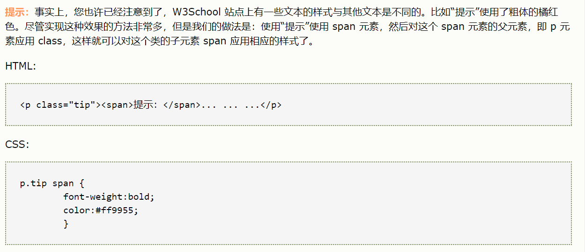

## HTML
`<div>`定义了文档的区域，块级（block-level）  
`<span>`用来组合文档中的行内元素，内联元素（inline）

`<input type="text" class="input" placeholder="研究基因获奖小学生父亲致歉"/>`  
设置输入框的方式  

## CSS
`:nth-of-type(n)`   
选择器匹配属于父元素的特定类型的第 N 个子元素的每个元素.   
N 可以是数字、关键词或公式。
```
<!DOCTYPE html>
<html>
<head>
<style> 
p:nth-of-type(2)
{
background:#ff0000;
}
</style>
</head>
<body>

<h1>这是标题</h1>
<p>第一个段落。</p>
<p>第二个段落。</p>
<p>第三个段落。</p>
<p>第四个段落。</p>
<p>第五个段落。</p>

</body>
</html>
```
效果：第二个段落背景变红

`:nth-child(n)`   
选择器匹配属于其父元素的第 N 个子元素，不论元素的类型。  
N 可以是数字、关键词或公式。
```
<!DOCTYPE html>
<html>
<head>
<style> 
p:nth-child(2)
{
background:#ff0000;（红色）
}
</style>
</head>
<body>

<h1>这是标题</h1>
<p>第一个段落。</p>
<p>第二个段落。</p>
<p>第三个段落。</p>
<p>第四个段落。</p>

<p><b>注释：</b>Internet Explorer 不支持 :nth-child() 选择器。</p>

</body>
</html>
```
效果：第一个段落背景变红（算上了标题）


**-of-type和-child的区别：**(自总结，不确定)   
前者在数数时只算那些符合特定类型的，但后者只要匹配的（？）都会数上  
但两者的格式只应用于特定的类型  
注：序号从1开始，而非从0

`z-index: 100;`   
z-index是把DIV设置到了最顶层，用来做导航栏  
`position: fixed;`  
固定div位置，用来做导航栏  
`line-height: 30px;`  
设置行高  
`border-radius: 2px;`  
设置圆角大小，可用于搜索框  
`border: 1px solid #c8cccf;`
设置边框厚度与颜色，可用于搜索框  
```
-webkit-appearance: none;
-moz-appearance: none;
```
取消搜索框的原格式  
