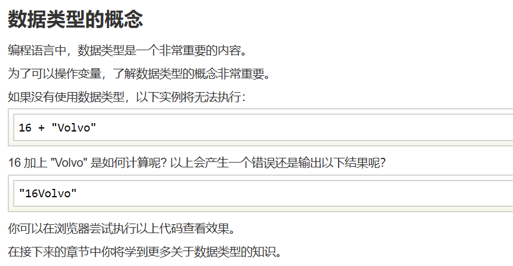
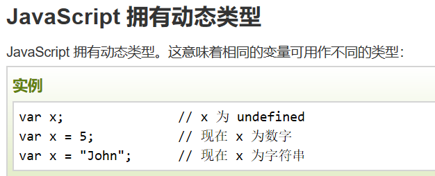
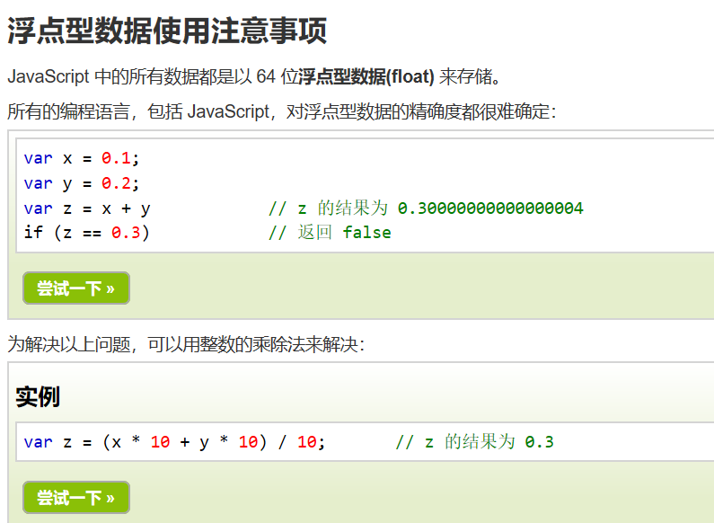
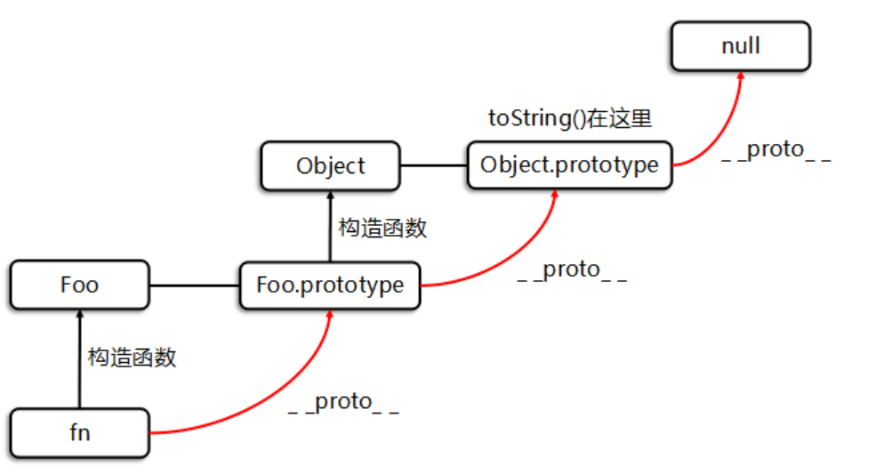

> 参考教程 http://yanhaijing.com/basejs/#sect_values
# 一. 学习误区
1.过早追求"系统”学习。人的精力是有限的，要尊重学习规律,承认自己是普通人，告诫自己不要取巧，不要贪婪,慢慢来。  
2.觉得读源码是最"本质”的学习，结果是掉进细节的深坑不能自拔   
3.过早埋头进“最新”技术,比如框架，在没有良好的语言基础之前学,事倍功半,”最新"技术和核心技术很多时候不是一回事, 有了基础和核心，学新技术才是最有效率的，反过来却不成立  
4.把编程学习等同于看书积累“知识”， 但编程最终是一种技能， 不动手什么也学不会，“知道"什么和”会” 什么是两回事  
5.具体的东西不学，却一开始就试图找到“最佳”学习路径，这是一种浪费。  
6.过分堆砌学习资料。越是罗列，噪声越大，心理压力和挫败感越强，越容易放弃,在一个阶段，一本书，配合少量网络资料足够了。

# 二. 基础语法
`<script src="myScript.js"></script>`【引用外部JS文件】  

`document.getElementById("demo").innerHTML=Date();`【id为demo的部分改为Date()(显示日期)，实现文字替换】
也可以用以下方式：
```
x=document.getElementById("demo");  // 找到元素
x.innerHTML="Hello JavaScript!";    // 改变内容
```
`document.write("<p>这是一个段落。</p>");`【输出。HTML 输出流中使用 document.write，相当于添加在原有html代码中添加一串html代码。而如果在文档加载后使用（如使用函数），会覆盖整个文档。】   

`<button type="button" onclick="alert('欢迎!')">点我!</button>`  【创造按钮。注意这是HTML语句】    

`element.src.match("bulbon")`【用于检索element元素的src属性的值（？）里有没有bulbon字符串，如果有返回1，无则返回0】  

实例：点击灯泡实现开关功能
```
<script>
function changeImage()
{
	element=document.getElementById('myimage')
	if (element.src.match("bulbon"))
	{
		element.src="/images/pic_bulboff.gif";
	}
	else
	{
		element.src="/images/pic_bulbon.gif";
	}
}
</script>

<p>点击灯泡就可以打开或关闭这盏灯</p>
```
`x.style.color="#ff0000";`  【改变HTML样式。注意此处的x与上面的element都对应着HTML元素】  
`<input id="demo" type="text">`【创建输入框，加上id即可检测输入内容】  
`var x=document.getElementById("demo").value;`【x取元素demo对应的值value，var表示创建js变量x】  

## 标识符与变量名  
 标识符分为三类：关键字，预定义标识符，用户自定义标识符  
 用户自定义标识符，包括变量名、常量名、对象名、函数名、类型名等等  
- 变量必须以字母开头(任何Unicode字符)  
- 变量也能以 $ 和 _ 符号开头（不过不推荐这么做   

可以说 "JavaScript 对象是变量的容器"。  
但是，我们通常认为 "JavaScript 对象是键值对的容器"。  

默认行高是默认字母大小+4（p默认字体16px）     

## 数据类型  
  结果：是16Volvo
  
  

## 值
JavaScript中的所有值都有属性，每个属性有一个键（或名字）和一个值  
可以用点操作(.)读取属性值  
`value.propKey`  
举个例子：字符串“abc”有属性lenght（长度）。  
```
 > var str = 'abc';
 > str.length
   3
```
也可以写成
```
> 'abc'.length
  3
```

## 原始类型值和对象
原始值包括：boolean，number，string，null和undefined，  
所有其他的值都是对象。对象被定义为:所有不为原始值的值，包括简单对象、数组、正则表达式对象等

有两个操作符可以用来将值分类：typeof 主要用于原始值，instanceof 主要用于对象  

`typeof «value»`
- 函数的类型是“function”而不是“object”。鉴于函数（类型为“function”）是对象（类型是对象）的子类型，这不是一个错误。
- null的类型是“object”。这是一个bug  
  
`«value» instanceof «Constr»`

#### 包装类型：原始类型的关联类型  
包括Boolean, Number, String  
用途：当作函数调用时，可将值转换为原始类型
```
> Number('123')
  123
> String(true)
  'true'
```
## 布尔
二元逻辑运算符会返回操作数中的一个——可能是一个布尔值，也可能不是：

与：如果第一个操作数是假值，返回第一个。否则返回第二个操作数。  
或：如果第一个操作数是真值，返回第一个。否则，返回第二个操作数。

## 数字
JavaScript中的所有数字都是浮点型  

特殊数字：  
**NaN** (“not a number”): 错误值  
**Infinity**：也是最大错误值（溢出），比任何值都大

运算符：注意自减是: –variable, variable–  

## 字符串
形式：'abc'或"abc"  
以下情况可以用转义字符`\`  
```
'Did she say "Hello"?'  
"Did she say \"Hello\"?"  
```
可以通过方括号访问单个字符：
```
> var str = 'abc';
> str[1]
  'b'
```
length属性是字符串的字符数量:
```
> 'abc'.length
  3
```
提醒：字符串是不可变的，如果想改变现有字符串，需要创建一个新的字符串。

可通过加号操作符（+）拼接，如果其中一个操作数为字符串，会将另一个操作数也转换为字符串。  
```
> var messageCount = 3;
> 'You have '+messageCount+' messages'
  'You have 3 messages'
```
#### 字符串方法
```
> 'abc'.slice(1)  // 复制子字符串
  'bc'  // 从1号开始到结束（包括1号）
> 'abc'.slice(1, 2)
  'b'  // 从1号开始到2号结束（不包括2号）

> '\t xyz  '.trim()  // 移除空白字符
  'xyz'

> 'mjölnir'.toUpperCase()  // 转换为大写
  'MJÖLNIR'

> 'abc'.indexOf('b')  // 查找字符串
  1
> 'abc'.indexOf('x')
  -1
```

## 函数
函数中缺少的参数是undefined
### 函数声明提升
需要先理解JS的编译和运行顺序：先按照代码块顺序编译（预处理）后执行——边编译边处理。编译时会标记声明型函数（而不会标记函数表达式（赋值型函数说法不准确））。因此对外表现就是JS可以在函数声明之前调用函数。但对于函数表达式这样做只会报错undefined
### 特殊变量arguments
当在js中在调用一个函数的时候，经常会给这个函数传递一些参数，js把传入到这个函数的全部参数存储在arguments中
```
> function f() { return arguments }
> var args = f('a', 'b', 'c');
> args.length
3
> args[0]  // 获取索引为0的元素
'a'
```
注：arguments只是类数组，有length等属性，没有数组的方法。不过可以通过一些操作将其转换为数组。  

实例：遍历参数求和
```
function add() {
    var sum =0,
        len = arguments.length;
    for(var i=0; i<len; i++){
        sum += arguments[i];
    }
    return sum;
}
add()                           // 0
add(1)                          // 1
add(1,2,3,4);                   // 10
```
### 设置参数默认值
```
function pair(x, y) {
    x = x || 0;  // 如果x是真值（除了：null，undefined 等）操作符返回x。否则，它返回第二个操作数。
    y = y || 0;
    return [ x, y ];
}
```
### 强制参数数量
```
function pair(x, y) {
    if (arguments.length !== 2) {
        throw new Error('Need exactly 2 arguments');
    }
    ...
}
```

## 异常处理【？】
```
function throwException() {
    throw new Error('Problem!');
}

try {
    throwException();
} catch (e) {
    console.log(e);  // 错误：信息
    console.log(e.stack);  // 非标准，但大部分浏览器支持
}
```
try分支包裹易出错的代码，如果try分支内部抛出异常，catch分支将会执行。

## 严格模式
推荐开启：在JavaScript文件或script标签第一行添加如下语句：
'use strict';

## 变量作用域和闭包
建议每个变量使用一条语句
```
var x = 1;
var y = 2;
var z = 3;
```
变量的作用域总是整个函数（没有块级作用域），即使该变量是在函数内的if语句内定义的。  
函数内部声明变量的时候，一定要使用var命令。如果不用的话，实际上声明了一个全局变量
### "链式作用域"结构（chain scope）
子对象会一级一级地向上寻找所有父对象的变量。所以，父对象的所有变量，对子对象都是可见的，反之则不成立。
### 变量提升
变量声明会被提升，但赋值不会。如  
`var a = 3;`  
实际会被处理为  
`var a;···;a = 3;`  
注：函数声明优先于变量声明
### 闭包
闭包是一个函数加上和其作用域链的链接。  
或者说：闭包就是能够读取其他函数内部变量的函数。  
(参考：[阮一峰的网络日志](https://www.ruanyifeng.com/blog/2009/08/learning_javascript_closures.html))
```
　function f1(){

　　　　var n=999;

　　　　function f2(){ // f2就是闭包
　　　　　　alert(n);
　　　　}

　　　　return f2;

　　}

　　var result=f1();

　　result(); // 999
```
### IIFE：立即执行函数表达式
声明函数的同时立即调用这个函数  
```
(function foo(){
  var a = 10;
  console.log(a);
})(); 
```
作用相当于：
```
function foo(){
  var a = 10;
  console.log(a);
}
foo();
```
但IIFE具有的优点：**隔离作用域**  
> JS只有全局作用域（global scope）、函数作用域（function scope），从ES6开始才有块级作用域（block scope）。对比来看，JS在访问控制这方面十分脆弱。那么如何实现作用域的隔离呢？在JS中，只有function才能实现作用域隔离，因此如果要将一段代码中的变量、函数等的定义隔离出来，只能将这段代码封装到一个函数中。

参考资料：[Javascript IIFE](https://www.jianshu.com/p/5b5de313015c)

### 闭包实现变量共享
```
var result = [];
for (var i=0; i < 5; i++) {
    result.push(function () { return i });  // (*)
}
console.log(result[1]()); // 5 (不是 1)
console.log(result[3]()); // 5 (不是 3)
```
(*)行的返回值总是当前的i值，而不是当函数被创建时的i值。  
解决方法：使用 IIFE：
```
for (var i=0; i < 5; i++) {
    (function (i2) {
        result.push(function () { return i2 });
    }(i));  // 复制当前的i
}
```
## 对象和继承
字面量创建对象法：
```
var o1 = {
    p:”I’m in Object literal”, // 属性1
    alertP:function(){ // 属性2
        alert(this.p);
    }
}
//每个属性都是一对（键和值）
```
缺陷：每创建一个新的对象都需要写出完整的定义语句，不便于创建大量相同类型的对象，不利于使用继承等高级特性  

构造函数+new表达式创建对象法：
```
// 设置实例数据
function Point(x, y) {
    this.x = x;
    this.y = y;
}
// 方法 【Point.prototype属性包含对象的方法】
Point.prototype.dist = function () {
    return Math.sqrt(this.x*this.x + this.y*this.y);
};
var p = new Point(3, 5);
> p.x
3
> p.dist()
5.830951894845301
```
其中，p是Point一个实例

**点操作符(.)** 可以读取/改写对象的属性，也可以用`[ ]`(动态读取)  
**delete操作符** 可以删除对象的属性`delete jane.name`  
**in操作符** 用来检测一个属性是否存在：
```
> 'newProperty' in jane
true
```
若读取一个不存在的属性，将会得到undefined值。因此上面的检查也可以像下面这样：
```
> jane.newProperty !== undefined
true
```
以上(.)规则只适用于标识符键名。若想用其他任意字符串作为键名，必须在对象字面量里加上引号，并使用方括号获取和设置属性。
### 引用方法
如果你引用一个方法（对象的函数），它将失去和对象的连接。就其本身而言，函数不是方法，其中的this值为undefined（严格模式下）。  

解决办法是使用函数内置的bind()方法。它创建一个新函数，其this值固定为给定的值。

## 数组
字面量创建数组法：
```
var arr = [ 'a', 'b', 'c' ];
```
**length属性**总表示一个数组有多少项元素：
```
> arr.length
3
```
若强行减小length的值会从后往前移除数组元素  
**in操作符**也可以在数组上工作。
```
> 1 in arr // arr在索引为1处是否有元素？
true
```
注:数组是对象，因此可以有对象属性：
```
> arr.foo = 123;
> arr.foo
123
```
### 数组方法
```
> var arr = [ 'a', 'b', 'c' ];

> arr.slice(1, 2)  // 复制元素
[ 'b' ]

> arr.push('x')  // 在末尾添加一个元素
4
> arr
[ 'a', 'b', 'c', 'x' ]

> arr.pop()  // 移除最后一个元素
'x'
> arr
[ 'a', 'b', 'c' ]

> arr.shift()  // 移除第一个元素
'a'
> arr
[ 'b', 'c' ]

> arr.unshift('x')  // 在前面添加一个元素
3
> arr
[ 'x', 'b', 'c' ]

> arr.indexOf('b')  // 查找给定项在数组中的索引
1
> arr.indexOf('y') 
-1

> arr.join('-')  // 将元素拼接为一个字符串
'x-b-c'
> arr.join('')
'xbc'
> arr.join()
'x,b,c'
```
以下两种方法可以遍历数组：
forEach遍历整个数组，并将**当前元素**和它的**索引**传递给一个函数：
```
[ 'a', 'b', 'c' ].forEach(
    function (elem, index) {  // 若括号内只有一个参数则无论怎么命名均代表element
        console.log(index + '. ' + elem);
    });
```

map创建一个新数组，通过**给每个存在数组元素应用一个函数**：
```
> [1,2,3].map(function (x) { return x*x })
[ 1, 4, 9 ]
```

## 正则表达式
正则表达式是构成搜索模式（search pattern）的字符序列  
可用于执行所有类型的文本搜索和文本替换操作   
具体实例和在线测试见[这里](https://c.runoob.com/front-end/854)

## 数学
Math是一个有算数功能的对象，如：
```
> Math.abs(-2)
2

> Math.pow(3, 2)  // 3^2
9

> Math.max(2, -1, 5)
5

> Math.round(1.9)
2

> Math.cos(Math.PI)  // 预定义常量π
-1
```

## console控制台操作
`console.log()`用于日志信息的常规输出。您可以在此方法中使用字符串替换和其他参数。  
`console.clear()`
清除控制台。  
`console.count()`
记录使用给定标签调用此行的次数。  
`console.error()`
输出错误信息。您可以在此方法中使用字符串替换和其他参数。    
(现象同log)  
`console.table()`
将表格数据显示为表格(参数必须写成数组形式)。  
`console.time()`
使用指定为输入参数的名称启动计时器。给定页面上最多可以同时运行10,000个计时器。  
`console.timeEnd()`
停止指定的计时器并记录自启动以来经过的时间（以秒为单位）。  
`console.timeLog()`
将指定计时器的值记录到控制台。  
注：后两句如果写成console.timeLog("answer time")会显示answer time:...ms否则直接显示...ms  
`console.warn()`
输出警告消息。您可以在此方法中使用字符串替换和其他参数。  
(现象同log)  
`console.info()`方法输出的信息性消息到Web控制台。  
(现象同log)    

使用字符串替换：
```
for (var i=0; i<5; i++) {
  console.log("Hello, %s. You've called me %d times.", "Bob", i+1);
}
```
## 日期Date
多种方法见[这里](https://developer.mozilla.org/en-US/docs/Web/JavaScript/Reference/Global_Objects/Date)

## 常见宿主环境及其全局对象
[参考资料](https://bbs.dian.org.cn/topic/1272/javascript%E5%B8%B8%E8%A7%81%E5%AE%BF%E4%B8%BB%E7%8E%AF%E5%A2%83%E5%8F%8A%E5%85%B6%E5%85%A8%E5%B1%80%E5%AF%B9%E8%B1%A1)
### 1.浏览器环境
#### ①document对象
通过访问document对象来访问html页面中的元素，如：
`document.getElementById(id);`
`document.getElementsByTagName(tagName);`
`document.getElementsByClassName(className);`
`document.querySelectorAll("");`通过CSS选择器查找
#### ②event对象
Event 对象代表事件的状态，比如事件在其中发生的元素、键盘按键的状态、鼠标的位置、鼠标按钮的状态。  
常与函数联用。
#### ③window对象等等
### 2.非浏览器环境
#### ①node.js
是运行在服务端的 JavaScript  
具体笔记见[Node.md](Node.md)
#### ②MongoDB
旨在为 WEB 应用提供可扩展的高性能数据存储解决方案  
是一个介于关系数据库和非关系数据库之间的产品

## JS原型对象与原型链
[参考资料](https://blog.csdn.net/qq_36996271/article/details/82527256?utm_medium=distribute.pc_relevant.none-task-blog-BlogCommendFromMachineLearnPai2-1.edu_weight&depth_1-utm_source=distribute.pc_relevant.none-task-blog-BlogCommendFromMachineLearnPai2-1.edu_weight)
- 所有的函数都有一个’prototype’属性(这也叫显式原型，它也是一个普通的对象)，该属性的类型是对象。
- 所有引用类型，它的’_ _ proto_ _'属性指向它的构造函数的’prototype’属性。
- 当试图得到一个对象的属性时，如果这个对象本身不存在这个属性，那么就会去它的’_ _ proto_ _'属性(也就是它的构造函数的’prototype’属性)中去寻找。  
写法：
```
//这是一个构造函数
		function Foo(name,age){
			this.name=name;
			this.age=age;
		}
		/*根据要点3，所有的函数都有一个prototype属性，这个属性是一个对象
		再根据要点1，所有的对象可以自由扩展属性
		于是就有了以下写法*/
		Foo.prototype={
			// prototype对象里面又有其他的属性
			showName:function(){
				console.log("I'm "+this.name);//this是什么要看执行的时候谁调用了这个函数
			},
			showAge:function(){
				console.log("And I'm "+this.age);//this是什么要看执行的时候谁调用了这个函数
			}
		}
		var fn=new Foo('小明',19)
		/*当试图得到一个对象的属性时，如果这个对象本身不存在这个属性，那么就会去它
		构造函数的'prototype'属性中去找*/
		fn.showName(); //I'm 小明
		fn.showAge(); //And I'm 19
```
优点：节省资源/空间。如果把原型对象里的函数属性直接写到构造函数里，那么每创建一个对象，该函数都要占用一部分空间。  

原型链：多个原型对象连接，如下图：


## 异步特性
JavaScript通常是单线程的  
异步地调用函数(比如，时间的推移，用户通过鼠标的交互，或者获取网络数据)使代码可以同时做几件事情，而不需要停止或阻塞主线程。
### Async callbacks
### Promise
```
console.log("registering click handler");

button.addEventListener('click', () => {
  console.log("get click");
});

console.log("all done");
```