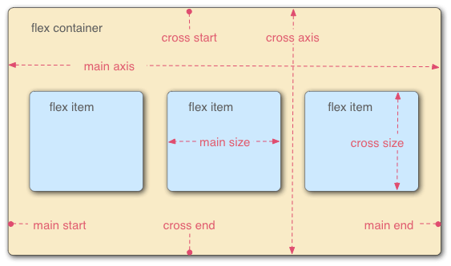
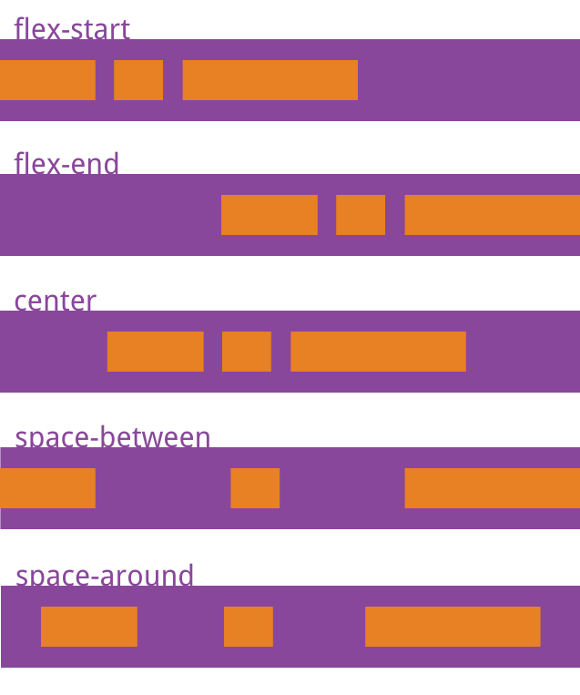
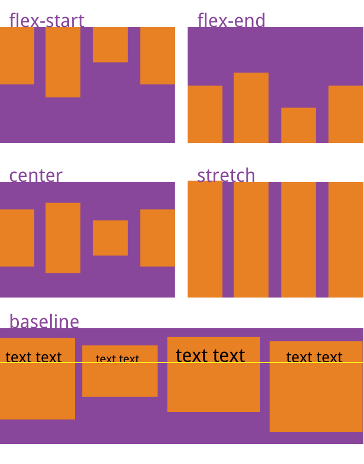
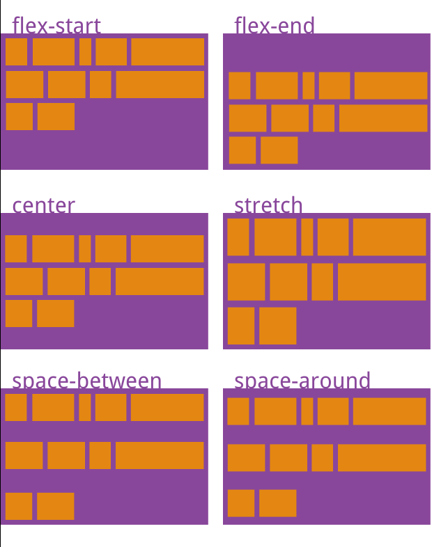

> 参考教程：
https://www.ruanyifeng.com/blog/2015/07/flex-grammar.html
http://static.vgee.cn/static/index.html

## 一. 基本概念

Flex 是 Flexible Box 的缩写，意为"弹性布局"，用来为盒状模型提供最大的灵活性。  
任何一个容器都可以指定为 Flex 布局：`.box{display: flex;}  `  
（设为 Flex 布局以后，子元素的float、clear和vertical-align属性将失效）  

## 二. 容器的属性
语法：`.box { flex-dirextion: ... ；} `
### 1. flex-direction  主轴的方向（即项目的排列方向）
**row（默认）**：行正向  
**row-reverse**：行逆向  
**column**：列正向  
**column-reverse**：列逆向  
### 2. flex-wrap  如何换行
**nowrap（默认）**：不换行  
**wrap**：在下方换行  
**wrap-reverse**：在上方换行  
### 3. flex-flow  flex-direction属性和flex-wrap属性的简写形式
`.box { flex-flow: <flex-direction> || <flex-wrap>; }`
### 4. justify-content 定义了项目在主轴上的对齐方式
**flex-start（默认）**：左对齐  
**flex-end**：右对齐  
**center**： 居中  
**space-between**：两端对齐，项目之间的间隔都相等。  
**space-around**：每个项目两侧的间隔相等，项目之间的间隔比项目与边框的间隔大一倍。  

注：图例是以flex-direction:row为例，实际主轴不一定左右  
### 5. align-items  定义项目在交叉轴上的对齐方式
**flex-start**：交叉轴的起点对齐。  
**flex-end**：交叉轴的终点对齐。  
**center**：交叉轴的中点对齐。  
**baseline**: 项目的第一行文字的基线对齐。  
**stretch（默认值）**：如果项目未设置高度或设为auto，将占满整个容器的高度。  

注：图例是以flex-direction:row为例，实际交叉轴不一定上下
### 6. align-content  定义了多根轴线（多行）的对齐方式
**flex-start**：与交叉轴的起点对齐。  
**flex-end**：与交叉轴的终点对齐。  
**center**：与交叉轴的中点对齐。  
**space-between**：与交叉轴两端对齐，轴线之间的间隔平均分布。  
**space-around**：每根轴线两侧的间隔都相等。所以，轴线之间的间隔比轴线与边框的间隔大一倍。  
**stretch（默认值）**：轴线占满整个交叉轴。  

## 三. 项目的属性
语法：
`.item {order: <integer>;flex-basis: <length>; | auto;}`
### 1. order 项目排列顺序
数值越小越靠前，默认为0
### 2. flex-grow 项目放大比例
默认为0，即如果存在剩余空间，也不放大（※）
### 3. flex-shrink 项目缩小比例
默认为1，即如果空间不足，该项目会缩小；为0则不会缩小；负值无效
### 4. flex-basis 在分配多余空间之前，项目占据的主轴空间（main size）
浏览器根据这个属性，计算主轴是否有多余空间。
默认为auto，即项目的本来大小。
### 5. flex 2~4的简写【建议优先】
两个快捷值：auto (1 1 auto) 和 none (0 0 auto)，flex-shrink和flex-basis选写  
`.item { flex: none | [ <'flex-grow'> <'flex-shrink'>? || <'flex-basis'> ] }`
### 6. align-self 允许单个项目有与其他项目不一样的对齐方式
可覆盖align-items属性  
默认为auto，表示继承父元素的align-items属性或strech（若无父元素）  
`.item {align-self: auto | flex-start |  flex-end | center | baseline | stretch;}`  
（除了auto均等同于align-items）