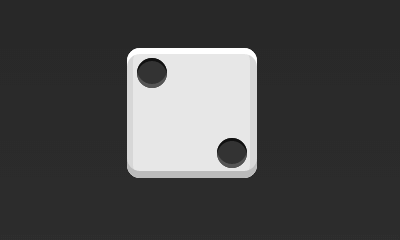
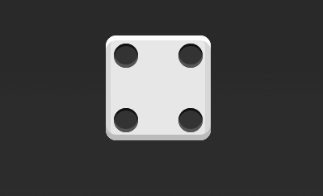
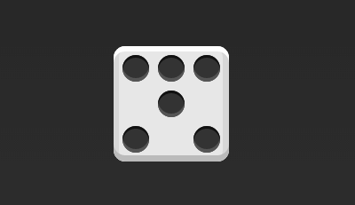

> 参考教程：https://www.ruanyifeng.com/blog/2015/07/flex-examples.html

## 一. 骰子布局🎲  
> 放置黑点时用`<span>`，整体用`<div class="box">`盒子盛着，有时需要加`<div class="column">`对每一行进行格式限定

  

HTML:
```
<div class="box">
      <span class="item"></span>
      <span class="item"></span>
</div>
```
CSS：
```
.box {
  display: flex;
  justify-content: space-between;
}
.item:nth-child(2) {<!--HTML中第二个适配item区域的格式-->
  align-self: flex-end;
}
```
或者这样写：  
HTML:
```
<div class="second-face">
  <span class="pip"></span>
  <span class="pip"></span>
</div>
```
CSS:
```
.second-face {
  display: flex;
  justify-content: space-between;
}
.second-face .pip:nth-of-type(2) {<!--这里运用nth-of-type()和nth-child()是一样的-->
<!--这里写成.second-face .pip是因为原网站上在不同的face class中有多个pip span，便于区分,不过注意要写空格！！-->
  align-self: flex-end;
}
```



HTML:
```
<div class="box">
  <div class="column"><!--这个实例中要多加一个column class-->
    <span class="item"></span>
    <span class="item"></span>
  </div>
  <div class="column">
    <span class="item"></span>
    <span class="item"></span>
  </div>
</div>
```
CSS:
```
.box {
  display: flex;
  flex-wrap: wrap;
  align-content: space-between;<!--多根轴线（多行）两端对齐-->
}

.column {
  flex-basis: 100%;
  display: flex;
  justify-content: space-between;<!--每行两端对齐（？还是每列）-->
}
```



HTML:
```
<div class="box">
  <div class="row">
    <span class="item"></span>
    <span class="item"></span>
    <span class="item"></span>
  </div>
  <div class="row">
    <span class="item"></span>
  </div>
  <div class="row">
     <span class="item"></span>
     <span class="item"></span>
  </div>
</div>
```
CSS:
```
.box {//class为box的格式
  display: flex;
  flex-wrap: wrap;
}

.row{//class为row的格式
  flex-basis: 100%;
  display:flex;
}

.row:nth-child(2){
  justify-content: center;<!--第二行居中对齐-->
}

.row:nth-child(3){
  justify-content: space-between;//<!--第三行两端对齐-->
}
```
完整实例：见 [an demo of dice](pics/flex-demo1.html) 